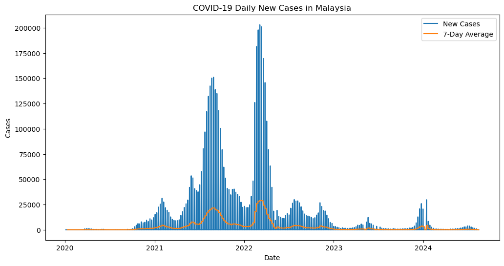
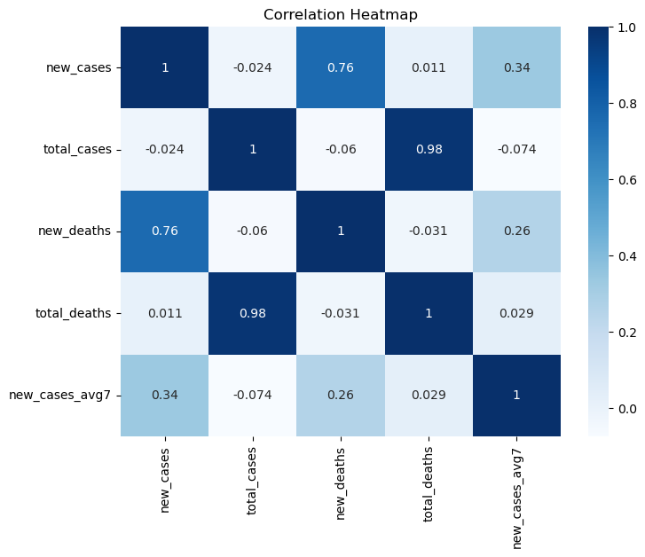
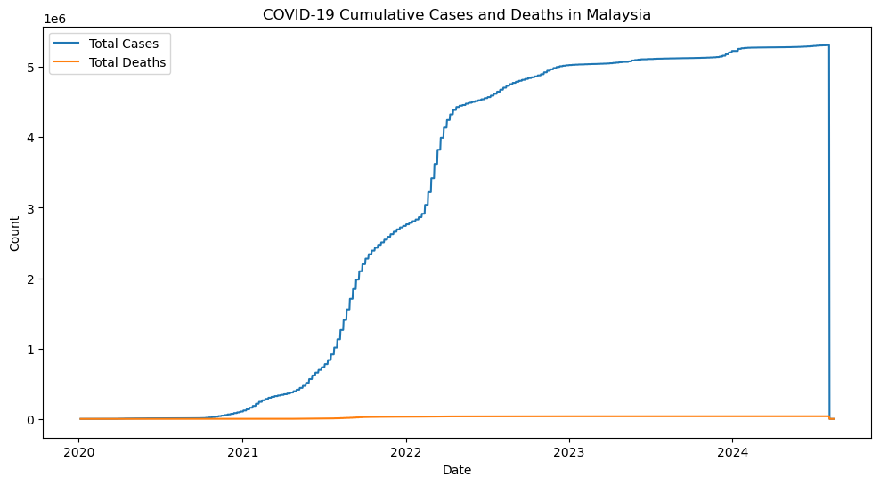

# COVID-19 ETL Project

This project demonstrates an ETL (Extract, Transform, Load) pipeline for COVID-19 case data in Malaysia. It includes data cleaning, transformation, and basic visualization to discover trends and insights.

## Technologies used
- Python
- Jupyter Notebook
- Pandas, NumPy
- Matplotlib, Seaborn

  ## Project Files
- `covid_etl_project.ipynb`: Main notebook with ETL and visualization
- `malaysia_covid_clean.csv`: Cleaned Malaysia COVID-19 dataset

## Key Learnings
- Implemented a real ETL pipeline from raw to clean data
- Handled missing data and invalid entries (#### dates, null values)
- Engineered a new metric: 7-day average for trend smoothing
- Applied EDA techniques to understand data relationships
- Built clear, interpretable visualizations

## How to Run
1. Clone the repository
2. Open the notebook using Jupyter Notebook or VS Code
3. Run all cells step by step
4. Optional: Modify code to explore other insights or regions

## Sample Visualizations

### New Cases with 7-Day Average

### Correlation Heatmap

### Cumulative Cases and Deaths in Malaysia

